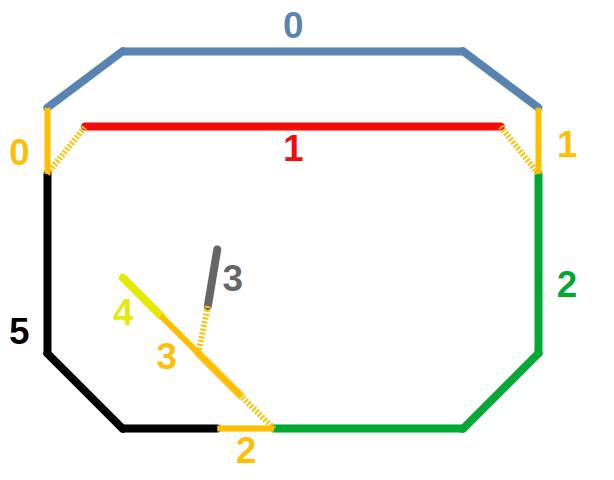

# TrainExecutionPlanService

## Docker build locally
```docker build -t train-test .```

```docker run -d --name python-test -p 80:80 -t train-test```


### Azure
```docker login trainplanregistry.azurecr.io -u TrainPlanRegistry -p XXXXXX```

```docker build -t trainplanregistry.azurecr.io/trainplanservice:rc-1 .```

```docker push trainplanregistry.azurecr.io/trainplanservice:rc-1```

```bash
    curl -X 'POST' \
         'http://127.0.0.1:8000/evaluate-execution-plan' \
         -H 'accept: application/json' \
         -H 'Content-Type: application/json' \
         -d [1,3,4,2,1,1,1,1]
```

| Array Index | Meaning                     |
|-------------|-----------------------------|
| 0           | Initial position of train 1 |
| 1           | Initial position of train 2 |
| 2           | Target position of train 1  |
| 3           | Target position of train 2  |
| 4           | Initial switch 0 state      | 
| 5           | Initial switch 1 state      | 
| 6           | Initial switch 2 state      | 
| 7           | Initial switch 3 state      |

Block positions: 0 | 1 | 2 | 3 | 4 | 5

Switch states: 0 | 1 (0 = straight, 1 = diverging)

Example: [1,3,4,2,1,0,1,0]
Train 1 position (initial): block 1
Train 2 position (initial): block 3
Train 1 position (target): block 4
Train 2 position (target): block 2
Switch 0 state: diverging
Switch 2 state: straight
Switch 3 state: diverging
Switch 4 state: straight


